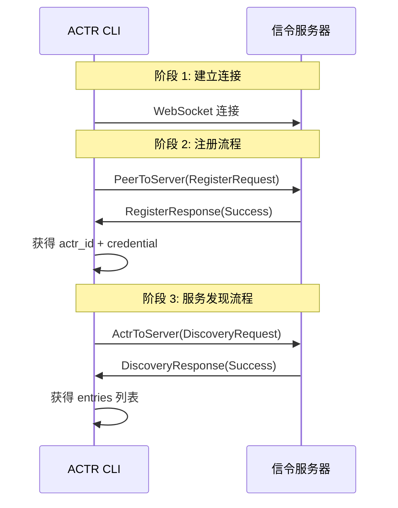
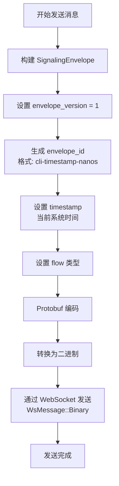
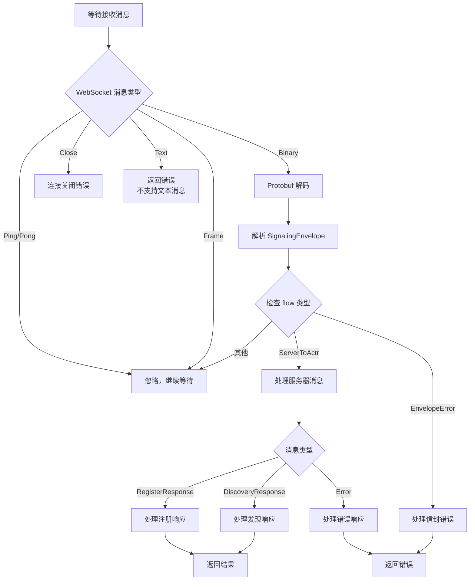

# 信令 WebSocket 交互流程

本文档描述了 ACTR CLI 与信令服务器之间的 WebSocket 交互流程。

## 概述

ACTR CLI 通过 WebSocket 连接到信令服务器，执行服务注册和服务发现操作。所有消息都通过 `SignalingEnvelope` 进行封装，使用 Protobuf 二进制格式传输。

## 核心组件

### NetworkServiceDiscovery

Single component responsible for signaling connection management and discovery:

```rust
pub struct NetworkServiceDiscovery {
    config: actr_config::Config,
    state: Mutex<Option<SignalingState>>,
}
```

### SignalingSession

Session data returned after a successful register:

```rust
struct SignalingSession {
    actr_id: ActrId,
    credential: AIdCredential,
}
```

### SignalingState

Cached signaling state stored in the mutex:

```rust
struct SignalingState {
    socket: SignalingSocket,
    session: SignalingSession,
}
```

## 消息格式

### SignalingEnvelope

所有消息都封装在 `SignalingEnvelope` 中：

```protobuf
message SignalingEnvelope {
  uint32 envelope_version = 1;        // 信封版本（当前为 1）
  string envelope_id = 2;             // 唯一标识符（格式：cli-{timestamp}-{nanos}）
  optional string reply_for = 3;       // 回复的消息 ID（可选）
  google.protobuf.Timestamp timestamp = 4;  // 时间戳
  optional string traceparent = 100;  // W3C 分布式追踪信息（可选）
  optional string tracestate = 101;    // W3C 追踪状态（可选）
  oneof flow {
    PeerToSignaling peer_to_server = 10;    // 客户端到服务器
    ActrToSignaling actr_to_server = 11;     // ACTR 到服务器
    SignalingToActr server_to_actr = 12;    // 服务器到 ACTR
    EnvelopeError envelope_error = 13;       // 信封错误
  }
}
```

### RegisterRequest

注册请求消息：

```protobuf
message RegisterRequest {
  ActrType actr_type = 1;            // ACTR 类型（必需）
  Realm realm = 2;                     // 领域（必需）
  optional ServiceSpec service_spec = 3;  // API/合约元数据（可选）
  optional Acl acl = 4;                // 访问控制列表（可选）
}
```

### RegisterResponse

注册响应消息：

```protobuf
message RegisterResponse {
  oneof result {
    RegisterOk success = 1;          // 注册成功
    ErrorResponse error = 2;           // 注册失败
  }
}

message RegisterOk {
  ActrId actr_id = 1;                 // 分配的 ACTR ID
  AIdCredential credential = 2;        // 认证凭证
  optional bytes psk = 3;              // 引导密钥材料（可选）
  optional google.protobuf.Timestamp credential_expires_at = 4;  // 凭证过期时间
  uint32 signaling_heartbeat_interval_secs = 5;  // 心跳间隔建议（秒）
}
```

### DiscoveryRequest

服务发现请求消息：

```protobuf
message DiscoveryRequest {
  optional string manufacturer = 1;   // 制造商过滤（可选）
  optional uint32 limit = 2;           // 结果数量限制（可选，默认 64）
}
```

### DiscoveryResponse

服务发现响应消息：

```protobuf
message DiscoveryResponse {
  oneof result {
    DiscoveryOk success = 1;          // 发现成功
    ErrorResponse error = 2;           // 发现失败
  }
}

message DiscoveryOk {
  repeated TypeEntry entries = 1;     // 服务类型条目列表
}

message TypeEntry {
  ActrType actr_type = 1;             // ACTR 类型
  string name = 2;                    // 服务名称（必需）
  optional string description = 3;    // 描述（可选）
  string service_fingerprint = 4;     // 服务指纹（必需）
  optional int64 published_at = 5;     // 发布时间戳（可选）
  repeated string tags = 6;            // 标签列表（如 "latest", "stable"）
}
```

### ErrorResponse

错误响应消息：

```protobuf
message ErrorResponse {
  uint32 code = 1;                    // 错误代码
  string message = 2;                 // 错误消息
}
```

### 基础类型

```protobuf
message ActrType {
  string manufacturer = 1;            // 制造商
  string name = 2;                    // 名称
}

message Realm {
  uint32 realm_id = 1;                // 领域 ID
}

message ActrId {
  Realm realm = 1;                    // 领域
  uint64 serial_number = 2;            // 序列号
  ActrType type = 3;                  // ACTR 类型
}
```

### Flow 类型

消息流向分为以下几种：

1. **PeerToServer** (`PeerToSignaling`): 客户端到服务器的消息
   - `RegisterRequest`: 注册请求

2. **ActrToServer** (`ActrToSignaling`): ACTR 到服务器的消息
   - `DiscoveryRequest`: 服务发现请求

3. **ServerToActr** (`SignalingToActr`): 服务器到 ACTR 的消息
   - `RegisterResponse`: 注册响应
   - `DiscoveryResponse`: 服务发现响应
   - `Error`: 错误响应

4. **EnvelopeError**: 信封错误

## 完整交互流程

### 1. 服务发现完整流程



### 2. 消息发送流程



### 3. 消息接收流程



## 代码实现细节

### 1. 建立连接

```104:119:src/core/components/service_discovery.rs
    async fn connect_and_register(
        &self,
        config: &actr_config::Config,
    ) -> Result<SignalingState> {
        let signaling_url = config.signaling_url.as_str();
        let (mut socket, _) = connect_async(signaling_url)
            .await
            .with_context(|| format!("Failed to connect to signaling: {signaling_url}"))?;
        let session = self
            .register(&mut socket, &config.package.actr_type, &config.realm)
            .await?;
        Ok(SignalingState {
            socket,
            session,
        })
    }
```

### 2. 注册流程

```151:191:src/core/components/service_discovery.rs
    async fn register(
        &self,
        socket: &mut SignalingSocket,
        actr_type: &ActrType,
        realm: &Realm,
    ) -> Result<SignalingSession> {
        let register_request = RegisterRequest {
            actr_type: actr_type.clone(),
            realm: realm.clone(),
            service_spec: None,
            acl: None,
        };

        let envelope =
            Self::build_envelope(signaling_envelope::Flow::PeerToServer(PeerToSignaling {
                payload: Some(peer_to_signaling::Payload::RegisterRequest(
                    register_request,
                )),
            }))?;

        Self::send_envelope(socket, envelope).await?;

        loop {
            let envelope = Self::read_envelope(socket).await?;
            match envelope.flow {
                Some(signaling_envelope::Flow::ServerToActr(server)) => match server.payload {
                    Some(signaling_to_actr::Payload::RegisterResponse(response)) => {
                        return Self::handle_register_response(response);
                    }
                    Some(signaling_to_actr::Payload::Error(error)) => {
                        return Err(Self::as_error("Register failed", &error));
                    }
                    _ => {}
                },
                Some(signaling_envelope::Flow::EnvelopeError(error)) => {
                    return Err(Self::as_error("Register failed", &error));
                }
                _ => {}
            }
        }
    }
```

### 3. 服务发现流程

```76:101:src/core/components/service_discovery.rs
    async fn discover_entries(
        &self,
        filter: Option<&ServiceFilter>,
    ) -> Result<Vec<discovery_response::TypeEntry>> {
        self.ensure_connected().await?;
        let mut state_guard = self.state.lock().await;
        let state = state_guard
            .as_mut()
            .context("Signaling state not initialized")?;
        let manufacturer = filter
            .and_then(|f| f.name_pattern.as_deref())
            .and_then(Self::extract_manufacturer)
            .or_else(|| {
                let m = &self.config.package.actr_type.manufacturer;
                if m.trim().is_empty() {
                    None
                } else {
                    Some(m.clone())
                }
            });

        let request = DiscoveryRequest {
            manufacturer,
            limit: None,
        };
        let payload = actr_to_signaling::Payload::DiscoveryRequest(request);
        let envelope =
            Self::build_envelope(signaling_envelope::Flow::ActrToServer(ActrToSignaling {
                source: state.session.actr_id.clone(),
                credential: state.session.credential.clone(),
                payload: Some(payload),
            }))?;

        let result = match Self::send_envelope(&mut state.socket, envelope).await {
            Ok(()) => loop {
                let envelope = Self::read_envelope(&mut state.socket).await?;
                match envelope.flow {
                    Some(signaling_envelope::Flow::ServerToActr(server)) => match server.payload {
                        Some(signaling_to_actr::Payload::DiscoveryResponse(response)) => {
                            break Self::handle_discovery_response(response);
                        }
                        Some(signaling_to_actr::Payload::Error(error)) => {
                            break Err(Self::as_error("Discovery failed", &error));
                        }
                        _ => {}
                    },
                    Some(signaling_envelope::Flow::EnvelopeError(error)) => {
                        break Err(Self::as_error("Discovery failed", &error));
                    }
                    _ => {}
                }
            },
            Err(err) => Err(err),
        };
        if result.is_err() {
            *state_guard = None;
        }
        result
    }
```

### 4. 消息发送

```245:257:src/core/components/service_discovery.rs
    async fn send_envelope(
        socket: &mut SignalingSocket,
        envelope: SignalingEnvelope,
    ) -> Result<()> {
        let mut buf = Vec::new();
        envelope
            .encode(&mut buf)
            .context("Failed to encode signaling envelope")?;
        socket
            .send(WsMessage::Binary(buf.into()))
            .await
            .context("Failed to send signaling envelope")?;
        Ok(())
    }
```

### 5. 消息接收

```260:279:src/core/components/service_discovery.rs
    async fn read_envelope(socket: &mut SignalingSocket) -> Result<SignalingEnvelope> {
        while let Some(message) = socket.next().await {
            match message.context("Failed to read signaling response")? {
                WsMessage::Binary(bytes) => {
                    return SignalingEnvelope::decode(bytes)
                        .context("Failed to decode signaling envelope");
                }
                WsMessage::Close(_) => {
                    return Err(anyhow!("Signaling connection closed"));
                }
                WsMessage::Ping(_) | WsMessage::Pong(_) => {}
                WsMessage::Text(text) => {
                    return Err(anyhow!("Unexpected text message from signaling: {text}"));
                }
                WsMessage::Frame(_) => {}
            }
        }

        Err(anyhow!("Signaling connection closed"))
    }
```

### 6. 构建信封

```281:299:src/core/components/service_discovery.rs
    fn build_envelope(flow: signaling_envelope::Flow) -> Result<SignalingEnvelope> {
        let now = SystemTime::now()
            .duration_since(UNIX_EPOCH)
            .context("System time is before UNIX_EPOCH")?;
        let timestamp = Timestamp {
            seconds: now.as_secs() as i64,
            nanos: now.subsec_nanos() as i32,
        };
        let envelope_id = format!("cli-{}-{}", now.as_secs(), now.subsec_nanos());

        Ok(SignalingEnvelope {
            envelope_version: 1,
            envelope_id,
            reply_for: None,
            timestamp,
            traceparent: None,
            tracestate: None,
            flow: Some(flow),
        })
    }
```

## 错误处理

### 错误类型

1. **连接错误**: WebSocket 连接失败
2. **编码/解码错误**: Protobuf 序列化/反序列化失败
3. **注册错误**: 服务器返回注册失败
4. **发现错误**: 服务器返回发现失败
5. **信封错误**: 信封格式错误
6. **连接关闭**: WebSocket 连接意外关闭

### 错误处理流程

```191:203:src/core/components/service_discovery.rs
    fn handle_register_response(
        response: actr_protocol::RegisterResponse,
    ) -> Result<SignalingSession> {
        match response.result {
            Some(register_response::Result::Success(success)) => Ok(SignalingSession {
                actr_id: success.actr_id,
                credential: success.credential,
            }),
            Some(register_response::Result::Error(error)) => {
                Err(Self::as_error("Register failed", &error))
            }
            None => Err(anyhow!("Register response is missing result")),
        }
    }
```

```229:237:src/core/components/service_discovery.rs
    fn handle_discovery_response(
        response: actr_protocol::DiscoveryResponse,
    ) -> Result<Vec<discovery_response::TypeEntry>> {
        match response.result {
            Some(discovery_response::Result::Success(success)) => Ok(success.entries),
            Some(discovery_response::Result::Error(error)) => {
                Err(Self::as_error("Discovery failed", &error))
            }
            None => Err(anyhow!("Discovery response is missing result")),
        }
    }
```

## Key Points

1. **Connection management**: `NetworkServiceDiscovery` caches a single WebSocket session in
   `state`; errors clear the cache and the next request reconnects.
2. **Message format**: All messages use Protobuf binary format wrapped in `SignalingEnvelope`.
3. **Registration flow**: Registration must succeed to obtain `actr_id` and `credential` before
   discovery requests.
4. **Message flow**: `Flow` variants distinguish peer/server directions and payload types.
5. **Error handling**: Read loops continue until the expected response or an error is returned.
6. **Timestamping**: Each envelope includes a timestamp for traceability.

## Example Usage

```rust
use actr_cli::core::{NetworkServiceDiscovery, ServiceDiscovery};

// 1. Load config
let config = config_manager.load_config(config_path).await?;

// 2. Create discovery component with config
let discovery = NetworkServiceDiscovery::new(config);

// 3. Use discovery (lazy connection happens internally)
let services = discovery.discover_services(filter.as_ref()).await?;
for service in services {
    println!("Service: {} ({})", service.name, service.uri);
}
```
